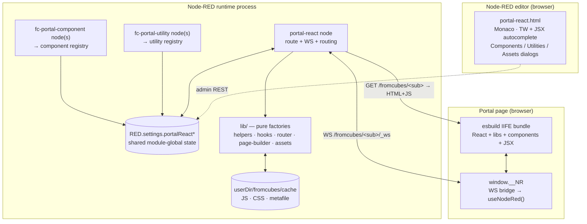
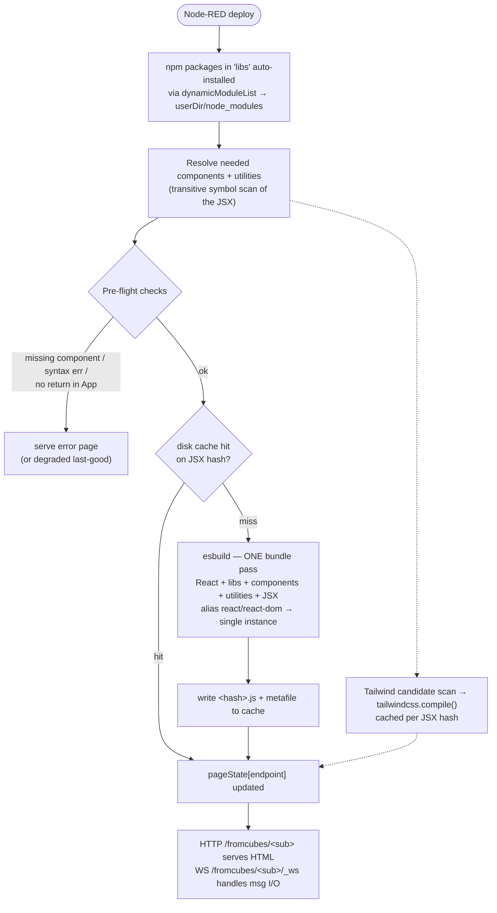
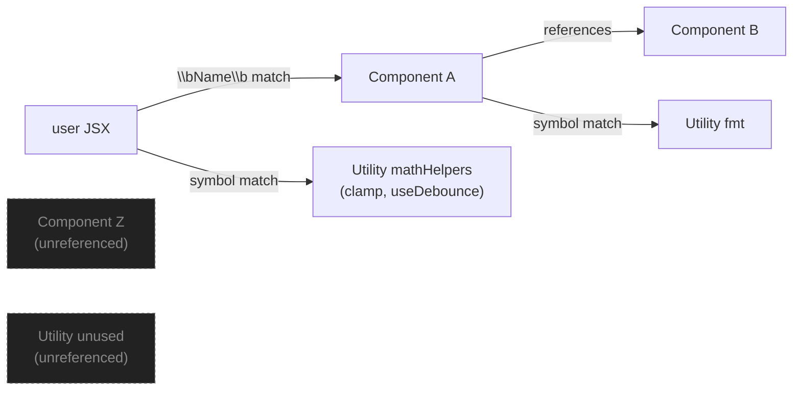
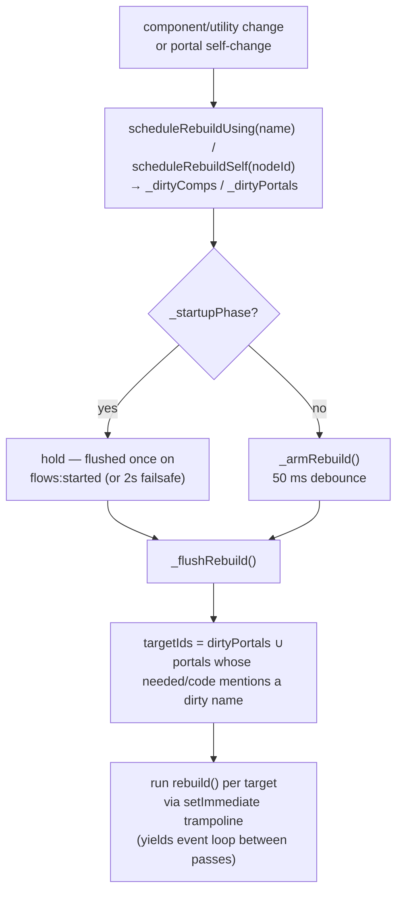
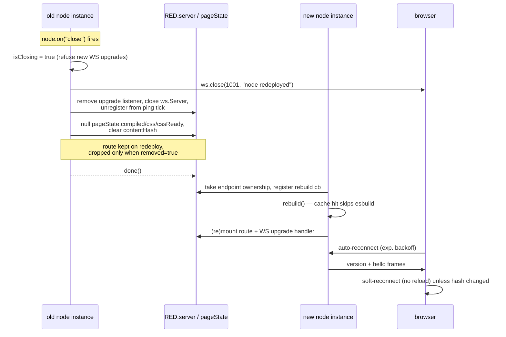
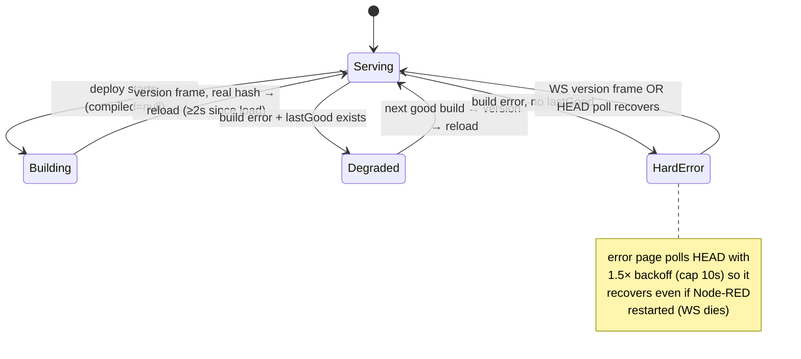
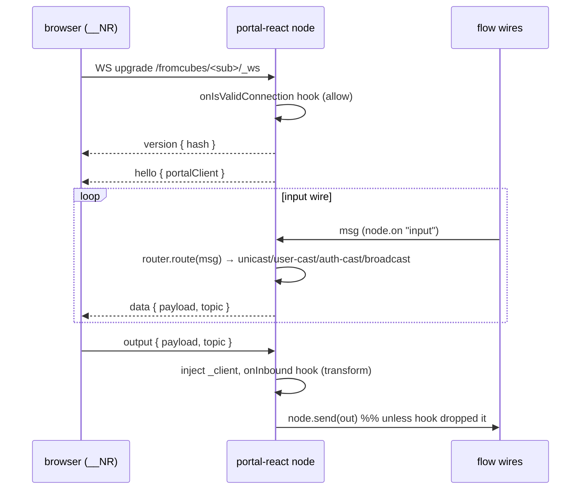
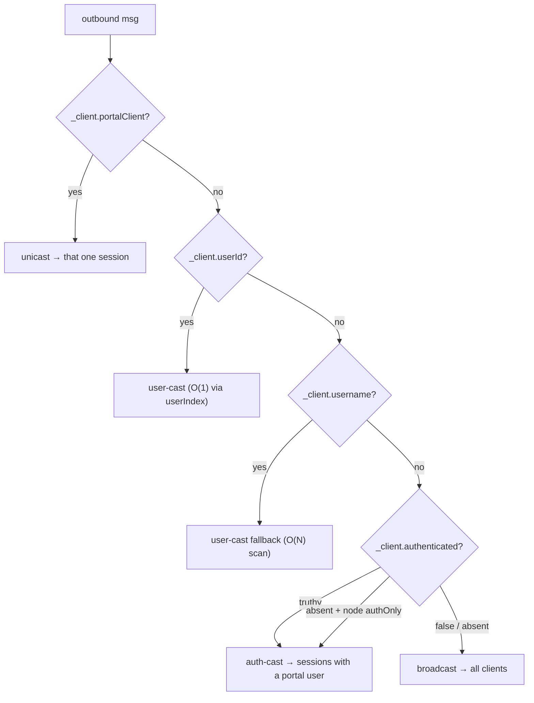

# @aaqu/fromcubes-portal-react — Developer guide

This document covers the parts a contributor or plugin author actually touches:
how the bundle is assembled at deploy, how the runtime keeps itself consistent
across rapid redeploys, the WebSocket wire protocol you can talk to from any
client, the admin/asset HTTP surface, and how to extend or iterate on this code
base locally.

For end-user docs (install, `useNodeRed()`, examples) see [README.md](./README.md).

The diagrams below are [Mermaid](https://mermaid.js.org/) — they render inline on
GitHub. ASCII fallbacks are kept where they read better in a plain terminal.

---

## Table of contents

- [Architecture at a glance](#architecture-at-a-glance)
- [Module-global state](#module-global-state)
- [What happens at deploy](#what-happens-at-deploy)
- [The shape of the bundle](#the-shape-of-the-bundle)
- [Selective inclusion — components and utilities](#selective-inclusion--components-and-utilities)
- [The rebuild scheduler](#the-rebuild-scheduler)
- [No-op redeploy detection](#no-op-redeploy-detection)
- [Deploy lifecycle and teardown](#deploy-lifecycle-and-teardown)
- [Reload-loop guards](#reload-loop-guards)
- [Degraded mode](#degraded-mode)
- [WebSocket protocol](#websocket-protocol)
- [WebSocket lifecycle and heartbeat](#websocket-lifecycle-and-heartbeat)
- [Message routing](#message-routing)
- [Plugin hooks](#plugin-hooks--extending-the-runtime)
- [Disk cache](#disk-cache)
- [Tailwind CSS pipeline](#tailwind-css-pipeline)
- [Portal Assets API](#portal-assets-api)
- [Security model](#security-model)
- [Repository layout](#repository-layout)
- [Iterating locally](#iterating-locally)
- [Contributing](#contributing)

---

## Architecture at a glance

Three node types share one module-global runtime. The portal node owns the HTTP
route + WebSocket; component and utility nodes only contribute code to the bundle
and trigger selective rebuilds.



`nodes/lib/*.js` is **pure**: factories that take `RED` (or a tiny shim) and
return functions. Anything Node-RED-specific lives in `portal-react.js`. Keep it
that way — every helper that ends up in `lib/` becomes unit-testable without
standing up Node-RED.

## Module-global state

Node-RED closes and re-opens **every** node on a Full deploy. To survive that
cycle, all cross-deploy state lives on the `RED.settings.portalReact*` namespace
(which persists), not in node-instance closures. The constructor lazily seeds
each table on first load.

| `RED.settings.` key | Holds |
|---|---|
| `portalReactComponentRegistry` | `{ compName: { code, error } }` — fc-portal-component bodies |
| `portalReactUtilities` | `{ utilName: { code, error } }` — fc-portal-utility bodies |
| `portalReactUtilSymbolOwners` | `{ symbol: utilName }` — which utility owns each top-level symbol |
| `portalReactCompNameOwners` | `{ name: nodeId }` — one shared namespace for component **and** utility names |
| `portalReactEndpointOwners` | `{ endpoint: nodeId }` — one portal per URL |
| `portalReactPageState` | `{ endpoint: PageState }` — the live build the GET route serves |
| `portalReactRegisteredRoutes` | `{ endpoint: true }` — route mounted only once per endpoint |
| `portalReactRebuildCallbacks` | `{ nodeId: rebuild() }` — lets component/utility changes re-transpile a portal |
| `portalReactPortalNeeded` | `{ nodeId: Set<compName> }` — component deps from the last build |
| `portalReactNeededUtilities` | `{ nodeId: Set<utilName> }` — utility deps from the last build |
| `portalReactPortalCode` | `{ nodeId: rawJSX }` — fallback to detect references to newly-added names |
| `portalReactSig` | `{ nodeId: hash }` — config signature for no-op redeploy skip |
| `portalReactUpgradeHandlers` | `{ nodeId: fn }` — WS upgrade listeners, for clean removal |
| `portalReactPingedServers` | `Set<ws.Server>` — shared heartbeat rotation |
| `portalReactPingTick` | `{ iv }` — the single shared ping interval |
| `portalReactRateBuckets` | `Map<ip, bucket>` — token-bucket rate-limit state |

## What happens at deploy



The only thing the browser receives is the resulting JS + CSS — no Babel, no
Sucrase, no compiler at runtime.

## The shape of the bundle

Inside the IIFE the order matters:

```
imports (hoisted, deduplicated)
React shorthand (React, ReactDOM, hooks pulled into local scope)
useNodeRed hook
utilities          ── concatenated raw, top level
library components ── each wrapped in its own IIFE that returns the named export
user JSX
createRoot(...).render(<App/>)
```

Utilities precede library components on purpose — a component can call
utility-declared helpers and hooks. Components and utilities are pulled in
**selectively** (see next section): anything unreferenced is left out of the
bundle entirely.

The exact assembly lives in `rebuild()` (`nodes/portal-react.js`). Two wrapping
rules:

- **Components** are wrapped per node: `const Name = (() => { <code>; return Name; })();`.
  One node exports exactly one named identifier.
- **Utilities** are concatenated raw at top level (`// Utility: <name>\n<code>`),
  so one node may declare many `function`/`const`/`let`/`class` symbols.

Imports from every source are extracted with a line regex, deduplicated, and
hoisted above the IIFE bodies. `import * as X` triggers a `node.warn` listing the
properties actually used (it defeats tree-shaking).

## Selective inclusion — components and utilities

Only the components and utilities whose top-level symbols appear (transitively)
in the user JSX — or in another included component — make it into the bundle.



- **Word-boundary matching** (`\b<name>\b`, regex cached per name) — so a
  component named `Button` does not pull in `ButtonGroup`.
- **Components**: `addWithDeps()` does a DFS — including a component then scans
  its body for references to every other registered component.
- **Utilities**: `addUtilWithDeps()` walks the same way over utility nodes — a
  utility is included as soon as **any** of its declared symbols is referenced by
  the JSX or by an already-included library component. Pulled-in utilities can in
  turn reference others.

The resolved sets are stored in `portalNeeded[nodeId]` / `portalNeededUtilities[nodeId]`
so a later component/utility change can target only the portals that use it.

## The rebuild scheduler

Component and utility changes don't rebuild every portal — they rebuild only the
portals whose resolved dependency set (or raw JSX) mentions the changed name. The
scheduler also coalesces bursts and collapses startup into a single pass.



Why each piece exists:

- **50 ms debounce** (`_armRebuild`) — coalesces several edits saved in one
  deploy into a single rebuild per affected portal.
- **Startup gate** (`_startupPhase`) — on first process start Node-RED constructs
  portal/component nodes sequentially over a window longer than the debounce.
  Without the gate, an early flush would rebuild a portal, then a late component
  registration would trigger a second rebuild. All flushes are held until
  `flows:started` (subscribed **once** per process via `RED.events.once`), with a
  2 s `setTimeout` failsafe for harnesses where the event never fires.
- **setImmediate trampoline** — a heavy rebuild queue yields the event loop
  between esbuild passes so the HTTP server stays responsive.

Match precedence inside `_flushRebuild`: a portal is rebuilt if a dirty name is in
its `portalNeeded`, its `portalNeededUtilities`, **or** appears as a substring of
its raw `portalCode` (the fallback that catches references to a freshly-added
component that was never in a `needed` set yet).

## No-op redeploy detection

A Full deploy reconstructs every node even when nothing changed. To avoid
rebuilding unchanged portals, the constructor hashes the portal's config:

```
sig = hash(componentCode ∥ JSON(libs) ∥ pageTitle ∥ customHead ∥ portalAuth ∥ showWsStatus)
```

It rebuilds only when `sig` changed **or** there is no fresh build to keep
serving (`hasFreshBuild(pageState[endpoint])`). The second clause matters: `close()`
nulls `compiled` during teardown, and a guard that checked only `building`/`error`
would treat the destroyed build as valid, skip the rebuild, and leave the GET
route serving the holding page forever. See `helpers.hasFreshBuild`.

## Deploy lifecycle and teardown



**Rapid deploys** (clicking deploy repeatedly) are safe:

- `isClosing` rejects new WS connections during teardown.
- Upgrade handlers are tracked per node id (`portalReactUpgradeHandlers`) — old
  ones are removed before new ones register, so listeners never pile up on
  `RED.server`.
- A 14 s safety `setTimeout` calls `done()` even if teardown blocks (Node-RED
  force-kills the close handler at 15 s).

`removed` is `true` when the node is **deleted or disabled** — only then are the
route, config signature, and disk cache dropped. A plain redeploy keeps
`pageState[endpoint]` so reconnecting clients hit the same build faster.

## Reload-loop guards

The recent class of bugs here was the portal reloading forever. Three invariants
prevent it; touch them carefully.

1. **Never advertise a hash the GET route can't serve.** The WS `version` frame
   only carries a non-empty hash when there is a serveable page. `serveableHash()`
   returns `""` for a nulled/torn-down `compiled` and for a hard build error with
   no fallback; it returns the **lastGood** hash in degraded mode. A stale
   non-empty hash would make the served error/building page reload on every frame.
   `close()` therefore also clears `state.contentHash`.

2. **The holding page is a 200, not a 500.** During the teardown window
   (`compiled === null`) the GET route serves a "Building…" holding page with
   `Cache-Control: no-store` and a WS reconnect script — it must never fall
   through to `state.compiled.error` (which would throw → 500 → catch → error
   page).

3. **One reload per 2 s, floor.** Both the live page (`window.__NR._reload`) and
   the standalone error page guard against reloading within 2 s of load. If the
   server is briefly inconsistent (error page served while a "ready" hash is
   advertised), this caps recovery to one reload / 2 s instead of a tight loop. A
   locally-caught runtime exception renders the same overlay node but must **not**
   trigger reload — the `version` handler only reloads on `_buildErrorActive` or a
   genuine hash change, never merely because an overlay is in the DOM.



## Degraded mode

When a rebuild fails but a previous good build exists, the portal **keeps serving
the last good JS** and shows a small dismissible banner instead of a full-screen
overlay:

- The GET route serves `state.lastGood.compiledJs`.
- New connections get an `error` frame with `degraded: true` → banner only.
- Node status uses a **ring** shape (vs **dot** for a hard failure) to signal
  "serving last good".
- `lastGood` is snapshotted only after CSS resolves on a successful build, so the
  fallback always has a matching CSS hash.

Fix the code and redeploy. The cache key is the JSX hash, so the next deploy
bypasses the broken cache automatically.

**Build-error attribution.** Before bundling, `rebuild()` distinguishes error
kinds so the node status and overlay point at the real culprit:

| `errorKind` | Status text | Trigger |
|---|---|---|
| `missing-component` | `missing: <Name>` (`+N`) | PascalCase tag with no provider (`findMissingComponentRefs`) |
| `component` | `broken: <Name>` | a referenced component has a syntax error |
| `utility` | `broken: <Name>` | a referenced utility has a syntax error |
| `missing-return` | `no return` | `function App` has no `return` |
| `transpile` | `transpile err` | esbuild bundling failed |
| `rebuild` | `rebuild err` | an unexpected exception inside `rebuild()` |

## WebSocket protocol

Frames are JSON. The browser-side bridge is `window.__NR` (in
`lib/page-builder.js`); `useNodeRed()` is a thin React wrapper over it.

| Direction | Type | Payload | Purpose |
|---|---|---|---|
| ← server | `hello` | `{ portalClient }` | Server-assigned session ID for this tab |
| ← server | `auth_required` | `{}` | Sent once after `hello` to anonymous sessions of an authenticated-only portal; surfaces as `useNodeRed().authRequired` |
| ← server | `version` | `{ hash }` | Content hash for deploy-reload detection (empty hash = ignore) |
| ← server | `data` | `{ payload, topic? }` | Routed flow message |
| ← server | `building` | `{}` | Server is rebuilding; browser shows the building overlay |
| ← server | `error` | `{ message, degraded? }` | Build/runtime error; `degraded:true` → banner over last-good build |
| → server | `output` | `{ payload, topic? }` | Result of `useNodeRed().send(...)` |
| → server | `runtime_error` | `{ message }` | Browser caught an exception in the bundle → red node status |

`runtime_error` lets a browser-side exception (e.g. a `ReferenceError`) surface as
a red node status even when the build itself succeeded. It is queued in
`_pendingRuntimeError` if it fires before the WS opens, then flushed in `onopen`.

The client **cannot forge `_client`** — the server overwrites it from socket state
on every inbound `output` frame.



### Talking to a portal from a non-React client

```javascript
const ws = new WebSocket("ws://localhost:1880/fromcubes/sensors/_ws");

ws.addEventListener("message", (evt) => {
  const m = JSON.parse(evt.data);
  switch (m.type) {
    case "hello":    console.log("connected as", m.portalClient); break;
    case "auth_required": console.warn("anonymous on an auth-only portal"); break;
    case "version":  /* m.hash — only needed for reload-on-redeploy */ break;
    case "data":     console.log("payload:", m.payload); break;
    case "error":    console.warn("server error:", m.message); break;
  }
});

ws.addEventListener("open", () => {
  ws.send(JSON.stringify({ type: "output", payload: { hello: "from a raw client" } }));
});
```

That's the entire contract. Reconnect logic and the building/error overlays are
all browser conveniences layered on top of these frames.

## WebSocket lifecycle and heartbeat

- **Upgrade handling** is per-node (`noServer: true`, `maxPayload: 1 MB`). A
  single `RED.server.on("upgrade")` listener per node id routes only its own
  `wsPath` to its `ws.Server`.
- **Identity on connect**: a fresh `portalClient` UUID is assigned; if Portal Auth
  is on, `ws._portalUser` is built from `x-portal-user-*` headers and indexed by
  `userId` for O(1) user-cast.
- **Heartbeat is centralised**: instead of N per-client `setInterval(ping, 30s)`,
  one shared module-level tick (`_pingSweep`) walks every registered `ws.Server`
  every 30 s, terminates sockets that missed the previous ping, and pings the
  survivors. The pong handler resets `ws._isAlive`. The tick auto-starts when the
  first server registers and clears when the last unregisters — 1 timer regardless
  of fan-out. All timers `unref()` so they never block process exit.

## Message routing

`lib/router.js` is a pure function — given `msg._client` and the client maps it
picks a delivery mode. Priority order:



With the node's **Authenticated-only delivery** setting (`ctx.authOnly`), an
untargeted msg defaults to auth-cast; `_client = { authenticated: false }` is
the explicit escape back to a true broadcast. Anonymous sessions of such a
portal receive one `auth_required` frame right after `hello` — once per
connection, never per skipped message, so they learn nothing about traffic
volume or timing.

Every send goes through `sendTo()` — the single chokepoint that applies the
`onCanSendTo` hook and handles dead sockets. `route()` returns `{ mode, delivered }`
for tests/observability.

## Plugin hooks — extending the runtime

Other Node-RED plugins (or your own scripts dropped into
`~/.node-red/node_modules`) can register hooks against the type
`fromcubes-portal-react`. Hooks add auth, audit, RBAC, message rewriting, etc.
without forking this module.

```javascript
RED.plugins.registerPlugin("my-portal-rbac", {
  type: "fromcubes-portal-react",
  hooks: {
    // Reject the WebSocket upgrade entirely.
    onIsValidConnection(request) {
      return request.headers["x-internal-secret"] === process.env.SECRET;
    },
    // Per-recipient veto on every outbound frame.
    onCanSendTo(ws, msg) {
      const role = ws._portalUser && ws._portalUser.role;
      if (msg.payload && msg.payload.__adminOnly) return role === "admin";
      return true;
    },
    // Mutate or drop every inbound msg before node.send(). Return null to drop.
    onInbound(msg, ws) {
      if (!ws._portalUser) return null;       // no anonymous writes
      msg.__audit = { at: Date.now() };
      return msg;
    },
  },
});
```

| Hook | Type | When | Arguments | Return | Call site |
|---|---|---|---|---|---|
| `onIsValidConnection` | allow | Before WS upgrade | `(request)` | `false` to reject | WS `upgrade` handler |
| `onCanSendTo` | allow | Before every outbound `ws.send()` | `(ws, msg)` | `false` to drop the frame for this ws | `sendTo()` |
| `onInbound` | transform | After a client `output`, before `node.send()` | `(msg, ws)` | mutated `msg`, or `null` to drop | `ws.on("message")` |

### `allow` vs `transform`

- **allow** — every registered hook must return `!== false`. AND-logic; first
  `false` short-circuits. A throwing hook is treated as `false` and logged via
  `RED.log.error`.
- **transform** — runs sequentially, each hook receives the previous hook's
  output. Returning `undefined` keeps the current value; anything else replaces
  it. A throwing hook is logged and skipped — the chain continues with the
  previous value.

### Debugging your hook

Hooks run inside the Node-RED process — anything you `RED.log.info(...)` shows up
in the Node-RED log. If your hook is silent: confirm the plugin package is in
`userDir/node_modules` and that its entry (referenced by
`package.json#node-red.plugins`) calls `RED.plugins.registerPlugin(...)`.

### End-to-end: a tiny RBAC plugin

1. Create `~/.node-red/node_modules/portal-rbac/`.
2. `package.json`:

   ```json
   {
     "name": "portal-rbac",
     "version": "0.0.1",
     "node-red": { "plugins": { "portal-rbac": "rbac.js" } }
   }
   ```

3. `rbac.js`:

   ```javascript
   module.exports = function (RED) {
     RED.plugins.registerPlugin("portal-rbac", {
       type: "fromcubes-portal-react",
       hooks: {
         onInbound(msg, ws) {
           const u = ws._portalUser;
           if (!u) return null;                       // anonymous → drop
           msg.actor = { userId: u.userId, role: u.role };
           return msg;
         },
       },
     });
   };
   ```

4. Restart Node-RED, open a portal page, click anything that calls `send(...)`,
   and inspect the inbound `msg` with a `debug` node — `msg.actor` should be
   present and anonymous tabs should produce nothing.

## Disk cache

Compiled output is cached under `userDir/fromcubes/cache/`, keyed by the JSX hash
(`<hash>.js`, `<hash>.meta.json`, `<hash>.css`). On rebuild, a cache hit skips
esbuild and Tailwind entirely.

- `readCachedJS` / `writeCachedJS` / `readCachedCSS` / `writeCachedCSS` — the
  read/write surface (all in `lib/helpers.js`).
- `deleteCacheFiles(hash)` removes all three extensions; called when a portal's
  hash changes **and** `isHashInUse()` confirms no sibling portal still relies on
  it (two portals with identical JSX share one cache entry).
- All cache I/O is best-effort: a write failure logs a warn and the build still
  serves from memory.

## Tailwind CSS pipeline

CSS is generated server-side, never in the browser:

1. `getTwCompiled()` lazily compiles the Tailwind base stylesheet once per
   process (memoised), resolving `@import 'tailwindcss'` via `require.resolve`.
2. `generateCSS(source)` scans the full JSX for class candidates
   (`/[a-zA-Z0-9_\-:.\/\[\]#%]+/g`), dedupes them, and calls `compiled.build()`.
3. The result is cached by JSX hash and served with a one-year immutable
   `Cache-Control`.

**Serving route.** The compiled JS is inlined into the HTML; the CSS is **not**.
The page links it via `<link href="${adminRoot}/portal-react/css/<hash>.css">`.
Two routes serve identical content from `pageState[*].css` by hash:

- `GET /portal-react/css/:hash.css` on `RED.httpAdmin` — the URL the page actually
  emits (works under a custom `httpAdminRoot`).
- `GET /fromcubes/css/:hash.css` on `RED.httpNode` — public equivalent.

Both constrain `:hash` to `^[a-f0-9]{1,64}$` so a hostile client can't probe
arbitrary `pageState` keys. A CSS-generation failure is non-fatal: the page still
loads (unstyled), node status shows a yellow `css-fail` ring, and the flag clears
on the next successful build.

## Portal Assets API

`lib/assets.js` mounts a file manager for static assets (3D models, textures,
fonts…). Admin routes are auth-gated + CSRF + rate-limited; public serving is
read-only.

| Method | Route | Router | Purpose |
|---|---|---|---|
| GET | `/portal-react/assets` | admin | List all files/dirs |
| POST | `/portal-react/assets/mkdir` | admin | Create directory |
| POST | `/portal-react/assets/move` | admin | Move / rename |
| POST | `/portal-react/assets/upload/*` | admin | Upload (raw body, 100 MB cap) |
| DELETE | `/portal-react/assets/*` | admin | Delete file/dir |
| GET | `/portal-react/assets/download/*` | admin | Download with `attachment` disposition |
| GET | `/fromcubes/public/*` | node (public) | Serve uploaded files |

**Path safety** (`safePath`): rejects empty input, > 1024 bytes, NUL, `..`/`.`,
Windows reserved names (CON/PRN/…), invalid chars, dotfiles, names ending in
space/dot, > 255-char segments, > 10-segment depth — then verifies the resolved
absolute path (and `fs.realpathSync`, to block symlink escape) stays inside the
assets root.

**Public-serving hardening**: `X-Content-Type-Options: nosniff`,
`Content-Security-Policy: default-src 'none'`, `Content-Disposition: attachment`
forced on dangerous extensions (`.html .htm .svg .js .mjs .xml .xhtml`), and
`dotfiles: deny`.

**Quotas**: 100 MB per file, 500 MB total, 1000 files max — checked before each
upload.

## Security model

This module is meant to run behind a trusted Node-RED instance, ideally behind a
reverse proxy.

- **Admin permission gate** — write endpoints require the `portal-react.write`
  scope (read endpoints `portal-react.read`) when `adminAuth` is configured.
  `needsPerm()` falls back to a no-op when `RED.auth` is absent (test harnesses,
  Node-RED < 1.0).
- **CSRF** — write endpoints require the `Node-RED-API-Version` header, which the
  editor XHR layer always sends and a cross-origin form/fetch cannot attach
  without a CORS preflight. Same trick the core admin API uses.
- **Rate limiting** — token bucket keyed by `req.ip`, default 60 burst / 1 req/s
  steady, tunable via `RED.settings.portalReact.rateLimit = { tokens, windowMs }`.
  Idle buckets are pruned every 5 min.
- **Payload caps** — 1 MB JSON body, 100 MB asset upload, 1 MB WebSocket frame.
- **Identity injection is server-side** — `msg._client` is rebuilt from socket
  state on every inbound frame; the browser cannot forge it. `x-portal-user-*`
  headers are trusted **unconditionally**, so production must terminate auth at a
  reverse proxy that strips inbound identity headers before injecting verified
  ones. The `x-portal-user-groups` JSON is size-capped (8 KB) before `JSON.parse`.
- **Name validation** — component/utility names must be valid JS identifiers
  ≤ 64 chars and are blacklisted against `Object.prototype` keys (prototype
  pollution guard). Sub-paths reserve `public` and `_ws` and block traversal.

## Repository layout

```
nodes/
  portal-react.js       Node-RED-bound runtime — registers portal-react,
                        fc-portal-component, fc-portal-utility node types;
                        manages WS lifecycle, builds bundles, runs the rebuild
                        scheduler, mounts admin REST + CSS + assets routes.
  portal-react.html     Editor UI for all three node types: Monaco (served from
                        node_modules at /portal-react/vs), Tailwind + JSX +
                        utility-symbol autocompletion, Components and Utilities
                        dialogs, Portal Assets sidebar.
  tw-candidates.js      Generates the ~19k Tailwind class-name list for editor
                        autocompletion (cached, served at /portal-react/tw-classes).
  lib/
    helpers.js          hash, transpile, generateCSS, validators, missing-ref
                        detection, serveableHash/hasFreshBuild, disk cache.
    hooks.js            Plugin hook dispatcher (allow + transform).
    router.js           Pure routing (unicast / user-cast / broadcast).
    page-builder.js     Browser HTML + window.__NR WS bridge + error/building
                        overlays.
    assets.js           Portal Assets file manager (validators + routes).
tests/
  helpers.test.js, hooks.test.js, routing.test.js, assets.test.js
examples/               Importable Node-RED flows.
```

## Iterating locally

```bash
# from the repo
npm test                # vitest, all units pure-JS
npm run test:watch      # iterate on lib/ changes
npm run docs            # jsdoc → docs/api
```

To run the plugin against a real Node-RED:

```bash
cd ~/.node-red
npm install /path/to/fromcubes-portal-react
npm start
```

What needs a restart vs just a deploy:

| You changed | Action |
|---|---|
| JSX, library components, utilities, examples | **Deploy** — the runtime tears down the affected portals and rebuilds them |
| `portal-react.html`, `tw-candidates.js`, editor assets | **Full browser refresh** of the editor (Node-RED caches editor assets hard; sometimes `Cmd/Ctrl-Shift-R`) |
| `nodes/portal-react.js`, `nodes/lib/*.js` | **Restart Node-RED** — the runtime is loaded once at startup; in-place edits are not picked up by deploy |

A handy loop while debugging the runtime: keep `npm run test:watch` in one pane
and Node-RED in another. Most regressions surface in the unit tests first because
`lib/` is intentionally pure.

### Test design

Tests use no Node-RED runtime. Files are pure-JS units with fake
`RED.plugins.getByType` and fake `ws` objects. See `tests/hooks.test.js` and
`tests/routing.test.js` for the shim patterns to copy.

When adding a new hook:

1. Update the doc block at the top of `nodes/lib/hooks.js`.
2. Wire the call site in `router.js` or `portal-react.js`.
3. Add a unit test next to the closest existing one (`hooks.test.js` for the
   dispatcher chain, `routing.test.js` for routing-time behaviour).

## Contributing

PRs welcome. Please:

- Run `npm test` before pushing.
- Keep `nodes/lib/*.js` Node-RED-free so it stays unit-testable.
- Match the null-drop convention for any new transform hook (falsy return = drop / skip).
- Preserve the [reload-loop invariants](#reload-loop-guards) when touching
  `close()`, `serveableHash`, `hasFreshBuild`, or the GET route.
- Update both READMEs when adding user-visible features.

## License

Apache-2.0
